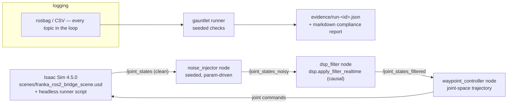

# MASTER_PLAN — Sim-to-Real Control Systems

> Created 2026-07-18. Companion doc: [AGENTS.md](AGENTS.md) — the engineering loop,
> agent lanes, and SDLC rules that execute this plan.

## 1. Intent & goals

**Intent:** the Physical-AI proof point — ONE recorded closed-loop demo with
certification-style evidence: a Franka arm in Isaac Sim tracks a joint-space
trajectory, injected sensor noise is cleaned in-loop by the repo's DSP filter, and
every run is auto-graded by a seeded "certification gauntlet" that emits a JSON
evidence packet and a markdown compliance report. The pitch in one line:
**"sim-to-real with receipts."**

**Goals (ranked):**
1. One command launches the full loop; seeded runs are reproducible.
2. The money artifact: a table of N ≥ 20 seeded runs, filtered vs. unfiltered,
   showing quantified improvement (tracking RMS, settling, overshoot, checks passed).
3. A 2–3 minute recorded demo: noisy run failing checks → filtered run passing →
   the evidence report.
4. DSP + gauntlet tests green in CI (no Isaac needed in CI).

**Scenario decision (binding):** Franka joint-space tracking. The repo has zero
mobile-robot assets but a complete Franka thread (`scripts/franka_wave.py`,
`scenes/franka_ros2_bridge_scene.usd` with an OmniGraph ROS 2 joint-state publisher).
A differential-drive scenario would be a from-scratch build — rejected.

**Non-goals:** real hardware, multiple scenarios, RL/learned control, photorealism,
Isaac-in-CI.

## 2. Architecture

Components live in: `dsp/` (existing library — FIR/IIR design, causal + zero-phase
apply, deterministic noisy-telemetry synthesizer, 4 passing tests),
`ros2-ws/src/control_loop/` (new package: the three nodes + launch),
`scripts/` (Isaac runners), `gauntlet/` (new: ported from the archived
`sim-to-real-benchmarking` repo — clone it read-only, copy the evidence-packet
generator in).

## 3. Requirements

Every PR must cite the REQ IDs it advances; verification method is binding.

| ID | Requirement | Verification |
|----|-------------|--------------|
| REQ-S2R-001 | `dsp/` is a proper installable package (`pyproject.toml`, `__init__.py`, no `sys.path` hacks); existing 4 tests still pass. | `pip install -e dsp/ && pytest dsp/` in CI. |
| REQ-S2R-002 | Noise injection node: parameter-driven (seed, noise profile), deterministic for a given seed, publishes `/joint_states_noisy`. | Unit test: same seed → identical output sequence. |
| REQ-S2R-003 | Filter node cleans noisy joint states in-loop using the CAUSAL `apply_filter_realtime` path (zero-phase offline variant is for analysis only). | Unit test with synthesized telemetry; attenuation ≥ spec at 25 Hz vibration band. |
| REQ-S2R-004 | Waypoint controller tracks a joint-space trajectory within tolerance on clean feedback (baseline sanity). | Sim run log: RMS tracking error under threshold recorded in evidence packet. |
| REQ-S2R-005 | One launch file (`closed_loop.launch.py`) brings up the full loop against a running Isaac scene; one documented command starts Isaac headless with the Franka scene. | Fresh-checkout walkthrough on the EdgeXpert, documented in README. |
| REQ-S2R-006 | Every run logs all loop topics to rosbag/CSV with the run seed embedded. | Inspect bag/CSV from a demo run; gauntlet consumes it. |
| REQ-S2R-100 | Gauntlet emits `evidence/run-<id>.json` per run: seed, scenario, per-check pass/fail (tracking RMS, settling time, overshoot, filter attenuation), environment/versions. | Gauntlet unit tests on recorded fixture data (no Isaac needed). |
| REQ-S2R-101 | A markdown compliance report renders from each evidence packet. | Golden-file test. |
| REQ-S2R-102 | Results table: ≥ 20 seeded runs each for filtered and unfiltered, committed with the evidence packets, showing quantified improvement. | Table + packets in repo; numbers regenerate from seeds. |
| REQ-S2R-200 | CI runs DSP + gauntlet tests on every PR (no Isaac/ROS runtime required in CI). | Green `.github/workflows/` run. |
| REQ-S2R-300 | README: pinned versions (ROS 2 Humble, Isaac Sim 4.5.0), block diagram, exact repro steps, results table, video link, limitations (sim-only, one scenario). Isaac import style unified across `scripts/` (new `isaacsim` API; `franka_wave.py` currently uses the old `omni.isaac.kit` import). | Doc review against fresh-clone walkthrough. |

## 4. Milestones & feature lanes

**M1 — Foundations** (FOCUS Week 5) → REQ-001, 300(partial)
- Lane A: package `dsp/`; kill sys.path hack.
- Lane B: unify Isaac imports; verify `franka_ros2_bridge_scene.usd` publishes joint
  states on the EdgeXpert; write the headless runner script.
- Lane C: README skeleton with pinned versions + scenario writeup.

**M2 — Closed loop** (Week 6) → REQ-002, 003, 004, 005, 006
- Lane A: `control_loop` package — noise injector + filter node (unit-testable
  without Isaac, against the DSP synthesizer).
- Lane B: waypoint controller + launch file.
- Integration (sequential, EdgeXpert): first full noisy-vs-filtered run, logged.

**M3 — Gauntlet** (Week 7) → REQ-100, 101, 102, 200
- Lane A: port evidence-packet generator from archived `sim-to-real-benchmarking`;
  checks + report renderer + tests.
- Lane B: CI workflow (DSP + gauntlet jobs).
- Integration (EdgeXpert): the 2×20 seeded-run campaign → results table.

**M4 — Record & ship** (Week 8–9) → REQ-300
- Screen capture, README finalization, blog post "Sim-to-real with receipts".

## 5. Environment split (important)

- **Anywhere (cloud agents, local models):** `dsp/`, `gauntlet/`, node unit tests,
  launch-file authorship, docs — everything except live sim.
- **EdgeXpert only:** Isaac Sim runs, integration campaigns, recording. Plan
  sessions so cloud/local-model work never blocks on the sim being up.

## 6. Risks & mitigations

- **ROS 2 Humble ↔ Isaac 4.5 bridge friction:** timebox bridge debugging; the
  OmniGraph publisher in the existing USD scene already works — build outward from it.
- **Controller tuning rabbit hole:** the demo needs *credible*, not optimal, tracking;
  fixed gains + documented tolerance is enough (REQ-004).
- **Scope creep:** second scenario, hardware, RL — all out. Add a REQ via PR first
  if something truly must grow.
