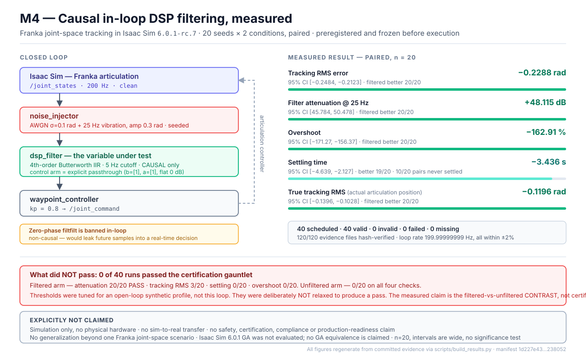

# Sim-to-Real Control Systems

**Control-systems engineering with receipts.** A Franka arm in Isaac Sim tracks a
joint-space trajectory while seeded sensor noise is injected into the feedback
path and cleaned in-loop by this repo's causal DSP filter. Every run is
auto-graded by a seeded "certification gauntlet" that emits an immutable JSON
evidence packet and a markdown compliance report.

---

## In 60 seconds

**What was built.** A closed control loop — Isaac Sim → `/joint_states` @ 200 Hz →
noise injector → causal DSP filter → waypoint controller → `/joint_command` →
articulation. Three ROS 2 nodes, each a pure-Python logic module plus a thin
`rclpy` wrapper, so the logic is testable with no ROS and no simulator.

**What was measured.** A preregistered, paired, filtered-vs-unfiltered campaign:
20 seeds × 2 conditions, design frozen and hashed before any run executed.
**40 scheduled · 40 valid · 0 invalid · 0 execution failures**, with 120/120 raw
source artifacts hash-verified.

> **`0 execution failures` is not a passing grade.** It means every run executed
> cleanly and was admitted under the preregistered exclusion rules — no harness
> error, no rate excursion, no short sample. It says nothing about the acceptance
> thresholds. **0 of 40 runs passed the full gauntlet.**

**What improved.** Causal in-loop filtering beat the unfiltered control arm on
every metric:

| Metric (paired, n=20) | Mean difference | 95% CI | Filtered better |
|---|---:|---|---:|
| Tracking RMS error | **−0.2288 rad** | [−0.2484, −0.2123] | 20/20 |
| Filter attenuation @ 25 Hz | **+48.115 dB** | [45.784, 50.478] | 20/20 |
| True articulation-position RMS | **−0.1196 rad** | [−0.1396, −0.1028] | 20/20 |

**What did *not* pass.** **0 of 40 runs passed the certification gauntlet.** The
filter passed its attenuation check 20/20, but the controller missed its
tracking, settling and overshoot thresholds. Those thresholds were tuned for an
open-loop synthetic profile, not this loop, and were deliberately **not** relaxed
to manufacture a pass. The measured claim is the filtered-vs-unfiltered
*contrast* — not certification of the controller.

**Where the evidence is.** [`docs/M4_CASE_STUDY.md`](docs/M4_CASE_STUDY.md) is the
full narrative and [`RESULTS.md`](RESULTS.md) is the generated results document.
Under `campaign/results/m4-franka-filtered-vs-unfiltered-v1/`:

| Path | What it holds |
|---|---|
| `filtered-<seed>/`, `unfiltered-<seed>/` | **the raw source artifacts** — one directory per run, each with `raw_evidence.json` plus the hashed `run_meta.json`, `telemetry.csv` and `truth.csv` |
| `evidence/run-*.json` | the **40 regenerated gauntlet packets** — graded output, derived from the raw artifacts above, not source |
| `campaign_results.json`, `campaign_summary.json` | aggregated paired analysis and the integrity index |

The **120-file integrity set** is the hashed raw source: 40 runs ×
{`run_meta.json`, `telemetry.csv`, `truth.csv`}. It does not include the
generated gauntlet packets, which are reproduced and compared separately.

Checking that the evidence is intact needs **no GPU, no ROS and no Isaac Sim**:

```bash
pip install -e dsp/ && pip install numpy scipy pytest
python -m pytest campaign/ -q
```

`campaign/test/test_committed_campaign.py` re-hashes every evidence file against
the digest recorded in its own packet, re-derives the execution plan from the
frozen manifest, and asserts every scheduled run is present, cites the frozen
manifest hash, started from the declared pose, and held the rate contract. A run
that was deleted, edited, or produced against a different manifest fails it.

`scripts/build_results.py` regenerates [`RESULTS.md`](RESULTS.md) from the raw
evidence — it is a **generation** command that writes in place, not a read-only
verifier. Full procedure, including how to confirm the design was frozen before
the runs: [`docs/REPRODUCE_CAMPAIGN.md`](docs/REPRODUCE_CAMPAIGN.md).

**What is explicitly NOT claimed.** Simulation only — no physical hardware was
involved. No sim-to-real transfer. No safety, certification, compliance or
production-readiness claim. No generalization beyond one Franka joint-space
scenario. All results were observed on Isaac Sim
`6.0.1-rc.7+release.42383.32955d8d.gl`, a **release candidate**; 6.0.1 GA is a
distinct, later release that this project has **not** evaluated, and no GA
equivalence is claimed.



---

Plan of record: [MASTER_PLAN.md](MASTER_PLAN.md) (intent, requirements,
milestones). Engineering loop and agent lanes: [AGENTS.md](AGENTS.md).

## Pinned versions

Versions are pinned by rule (AGENTS.md §2) — never "latest".

| Component | Version | Applies to |
|-----------|---------|------------|
| NVIDIA Isaac Sim | **`6.0.1-rc.7+release.42383.32955d8d.gl`** | **every empirical result in this repo** (release candidate; GA not evaluated) |
| ROS 2 | Jazzy, supplied by Isaac Sim's own runtime | the campaign host (no system ROS 2 installed) |
| ROS 2 | Humble | the `ros2-ws/` DevContainer build path only |
| Python (DSP/gauntlet, no ROS or Isaac needed) | 3.10+ with `numpy`, `scipy` | evidence verification on any machine |

> **Historical note.** This project was originally pinned to Isaac Sim 4.5.0.
> That pin blocked the campaign and was retired; all runtime validation and all
> 40 campaign runs were executed on the 6.0.1 release candidate above. See
> [`docs/M4_BASELINE.md`](docs/M4_BASELINE.md).

## The scenario (binding decision)

Franka joint-space tracking — a Franka arm in Isaac Sim
(`scenes/franka_ros2_bridge_scene.usd`, which carries an OmniGraph ROS 2
joint-state publisher) follows a joint-space trajectory while seeded noise is
injected into `/joint_states` and cleaned in-loop by the causal
`apply_filter_realtime` DSP path. Every run is seeded and reproducible; a
gauntlet grades tracking RMS, settling time, overshoot, and filter attenuation
into an evidence packet. The target artifact is a table of ≥ 20 seeded runs,
filtered vs. unfiltered, plus a 2–3 minute recorded demo.

Non-goals: real hardware, multiple scenarios, RL/learned control,
photorealism, Isaac-in-CI.

## Architecture


## Current status — M1–M3 complete; M4 runtime validated and the 40-run campaign executed

Honest state of the repo today:

> **Which simulator build the empirical claims are about.** All runtime
> validation and all 40 campaign runs were executed on exactly one build:
> Isaac Sim **`6.0.1-rc.7+release.42383.32955d8d.gl`**. That is a *release
> candidate*. NVIDIA's Isaac Sim 6.0.1 **GA is a distinct, later release, and
> this project has not evaluated it** — no run here was made on GA, and nothing
> here shows GA behaves the same. Every empirical result below is evidence
> about the tested RC build and should be read that way.

- **M4 campaign RUN (40/40 valid).** The preregistered filtered-vs-unfiltered
  campaign executed on a real Isaac Sim 6.0.1-rc.7 host: 20 seeds × 2 conditions,
  40 scheduled, **40 valid, 0 invalid, 0 failed**, every evidence file
  hash-verified. Filtered feedback beat unfiltered on every metric —
  tracking RMS 0.177 vs 0.406 rad (paired mean difference −0.229 rad, 95% CI
  [−0.248, −0.212], filtered better in 20/20 seeds) and 48.1 dB of attenuation
  at the 25 Hz disturbance band versus 0.0 dB. Numbers, uncertainty, failure
  analysis and non-claims: **[RESULTS.md](RESULTS.md)**. Every figure is
  regenerated from raw evidence by `scripts/build_results.py`; nothing is
  hand-entered. **Simulation only — no hardware, transfer, safety or
  certification claim.**
- **M4 runtime validated on Isaac Sim 6.0.1-rc.7** (`M4_RUNTIME_GATE_PASS`,
  on `6.0.1-rc.7+release.42383.32955d8d.gl`; GA not evaluated). Running
  it exposed three defects a static check could not: a publisher that emitted
  ZERO messages without `stageMetersPerUnit` wired, a default graph sampling at
  30.02 Hz that would have aliased the 25 Hz disturbance onto the 5 Hz cutoff,
  and an endogenous reference signal caught by a pilot run before the design was
  frozen. See **[docs/M4_RUNTIME_VALIDATION.md](docs/M4_RUNTIME_VALIDATION.md)**.
- **Verifying the evidence needs no GPU, ROS or Isaac** — only a clone and
  Python. See **[docs/REPRODUCE_CAMPAIGN.md](docs/REPRODUCE_CAMPAIGN.md)**.

- **M1–M3 complete (everything buildable/testable without a sim box):**
  - `dsp/` is the installable `s2r-dsp` package (REQ-S2R-001): FIR/IIR design,
    causal + zero-phase apply, seeded telemetry synthesizer, tests green.
  - `ros2-ws/src/control_loop/` — noise injector, causal DSP filter, and
    waypoint controller nodes + `closed_loop.launch.py` (REQ-S2R-002..005).
    Each node is a pure-Python logic module (unit-tested anywhere) plus a thin
    rclpy wrapper (`py_compile`-gated; runtime is `EDGEXPERT-VERIFY`).
  - `gauntlet/` — seeded checks, immutable JSON evidence packets, and the
    markdown compliance report (REQ-S2R-100/101).
  - `campaign/` — the aggregator that turns a directory of evidence packets
    into the filtered-vs-unfiltered "money table" (REQ-S2R-102).
  - CI runs the DSP + control_loop-logic + gauntlet + campaign tests on every
    PR with no ROS/Isaac dependency (REQ-S2R-200).
- **Remaining M4 work:** the recorded demo. The script and shot list are in
  **[docs/DEMO_OUTLINE.md](docs/DEMO_OUTLINE.md)**; no video is published from
  this repository.
- **Loop closed scene-side (was the blocking gap):**
  `scenes/franka_ros2_bridge_scene.usd` published `/joint_states` but nothing
  subscribed to `/joint_command`, so the controller could not drive the arm.
  The scene now carries a `ROS2SubscribeJointState` on `/joint_command` feeding
  an articulation controller, authored as data by
  `scripts/author_joint_command_graph.py` (no Isaac Sim needed) and verified in
  CI by `scenes/scene_contract.py`. **This is the scene-side contract only** —
  that Isaac loads the graph and the arm actually moves is still unverified.
- **Loop confirmed in the runtime (was unverified above).** Isaac 6.0.1-rc.7 loads
  the graph, `/joint_states` publishes at a measured 200 Hz, `/joint_command` is
  provably consumed, and the loop closes through the project's own
  `WaypointTracker`. The scene-side-only caveat above is now retired.
- **Historical note.** `docs/M4_BASELINE.md` records the earlier state, when the
  campaign was blocked on an Isaac Sim 4.5.0 pin. That blocker is resolved: the
  work moved to the Isaac Sim 6.0.1 release candidate identified above. The 6.0.1
  GA release postdates that move and was not adopted or tested here.

## Repository layout

| Path | Contents | Runs where |
|------|----------|-----------|
| `dsp/` | Filter design, causal/zero-phase apply, seeded telemetry synthesizer, tests, plots | Anywhere (plain Python) |
| `scripts/` | Isaac Sim runner scripts (Franka wave, scene setup, headless runner) | EdgeXpert / local Isaac Sim 4.5.0 box only |
| `scenes/` | `franka_ros2_bridge_scene.usd` with OmniGraph ROS 2 joint-state publisher | EdgeXpert only |
| `ros2-ws/` | ROS 2 Humble workspace: `src/control_loop/` (the closed-loop nodes + launch) plus legacy pub/sub examples | ROS 2 Humble environment |
| `notebooks/` | Exploratory DSP / kinematics notebooks | Anywhere (Jupyter) |
| `media/` | Screenshots and supporting images | — |
| `gauntlet/` | Certification gauntlet: seeded checks, immutable JSON evidence packets, compliance report | Anywhere (plain Python) |
| `campaign/` | Results aggregator: evidence packets → the filtered-vs-unfiltered money table (REQ-S2R-102) | Anywhere (plain Python) |
| `docs/` | `RUN_ON_EDGEXPERT.md` — the sim-box runbook and consolidated `EDGEXPERT-VERIFY` checklist | — |
| `MASTER_PLAN.md`, `AGENTS.md` | Plan of record; engineering loop and lane rules | — |

## How to run what exists today

### DSP (anywhere — the part you can verify in minutes)

```bash
python3 -m venv .venv
source .venv/bin/activate
pip install -r dsp/requirements.txt
pytest dsp/
```

Once REQ-S2R-001 (M1 Lane A) merges, the supported install becomes the
package itself:

```bash
pip install -e dsp/
pytest dsp/
```

Plot generation (Bode + time-domain comparisons) is described in
[QUICKSTART.md](QUICKSTART.md); design rationale lives in
[dsp/FILTER_DESIGN_WALKTHROUGH.md](dsp/FILTER_DESIGN_WALKTHROUGH.md).

### Isaac Sim scripts (local Isaac box only)

Require a local Isaac Sim 4.5.0 install (the EdgeXpert in this project's
setup); they cannot run in CI or cloud environments.

```bash
cd ~/isaac-sim   # your Isaac Sim 4.5.0 root
./python.sh /path/to/repo/scripts/franka_wave.py
./python.sh /path/to/repo/scripts/run_franka_headless.py --steps 600   # after M1 Lane B merges
```

### ROS 2 workspace (ROS 2 Humble environment)

```bash
cd ros2-ws
colcon build
source install/setup.bash
```

See [QUICKSTART.md](QUICKSTART.md) for per-environment details and example
entry points.

## Requirements & milestones

Work is traced to REQ IDs (REQ-S2R-001 … REQ-S2R-300) defined in
[MASTER_PLAN.md](MASTER_PLAN.md) §3; every PR cites the requirements it
advances. Milestones: M1 foundations → M2 closed loop → M3 gauntlet + CI →
M4 record & ship.

## Public demos

- Isaac Sim robot motion: https://youtu.be/E2jNcWM_f08
- Isaac Sim to ROS 2 data stream: https://youtu.be/MfsuIWZ5_eg

## Related public reference

Robotics terminology and SysML v2 examples: https://github.com/camirian/robotics-ontology-public

## License

Licensed under the Apache License 2.0. See [LICENSE](LICENSE).
