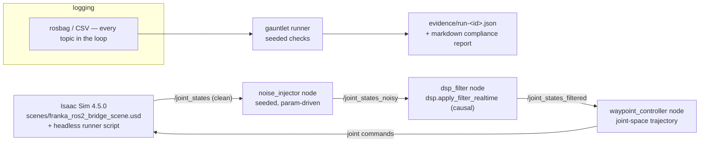

# Sim-to-Real Control Systems

**Sim-to-real with receipts.** One recorded closed-loop demo with
certification-style evidence: a Franka arm in Isaac Sim tracks a joint-space
trajectory, injected sensor noise is cleaned in-loop by this repo's DSP filter,
and every run is auto-graded by a seeded "certification gauntlet" that emits a
JSON evidence packet and a markdown compliance report.

Plan of record: [MASTER_PLAN.md](MASTER_PLAN.md) (intent, requirements,
milestones). Engineering loop and agent lanes: [AGENTS.md](AGENTS.md).

## Pinned versions

Versions are pinned by rule (AGENTS.md §2) — never "latest".

| Component | Version |
|-----------|---------|
| ROS 2 | Humble |
| NVIDIA Isaac Sim | 4.5.0 |
| Python (DSP, no ROS/Isaac needed) | 3.10+ with `numpy`, `scipy` |

## The scenario (binding decision)

Franka joint-space tracking — a Franka arm in Isaac Sim
(`scenes/franka_ros2_bridge_scene.usd`, which carries an OmniGraph ROS 2
joint-state publisher) follows a joint-space trajectory while seeded noise is
injected into `/joint_states` and cleaned in-loop by the causal
`apply_filter_realtime` DSP path. Every run is seeded and reproducible; a
gauntlet grades tracking RMS, settling time, overshoot, and filter attenuation
into an evidence packet. The target artifact is a table of ≥ 20 seeded runs,
filtered vs. unfiltered, plus a 2–3 minute recorded demo.

Non-goals: real hardware, multiple scenarios, RL/learned control,
photorealism, Isaac-in-CI.

## Architecture



## Current status — cloud milestones M1–M3 complete; M4 pending the EdgeXpert campaign

Honest state of the repo today:

- **M1–M3 complete (everything buildable/testable without a sim box):**
  - `dsp/` is the installable `s2r-dsp` package (REQ-S2R-001): FIR/IIR design,
    causal + zero-phase apply, seeded telemetry synthesizer, tests green.
  - `ros2-ws/src/control_loop/` — noise injector, causal DSP filter, and
    waypoint controller nodes + `closed_loop.launch.py` (REQ-S2R-002..005).
    Each node is a pure-Python logic module (unit-tested anywhere) plus a thin
    rclpy wrapper (`py_compile`-gated; runtime is `EDGEXPERT-VERIFY`).
  - `gauntlet/` — seeded checks, immutable JSON evidence packets, and the
    markdown compliance report (REQ-S2R-100/101).
  - `campaign/` — the aggregator that turns a directory of evidence packets
    into the filtered-vs-unfiltered "money table" (REQ-S2R-102).
  - CI runs the DSP + control_loop-logic + gauntlet + campaign tests on every
    PR with no ROS/Isaac dependency (REQ-S2R-200).
- **M4 pending on the EdgeXpert (needs live Isaac + ROS 2):** the actual
  20+20 seeded campaign that fills the money table with real numbers, and the
  2–3 minute recorded demo. The harness is built so **one command** produces
  the table once the loop runs — see
  **[docs/RUN_ON_EDGEXPERT.md](docs/RUN_ON_EDGEXPERT.md)** for the complete
  fresh-box-to-recorded-demo runbook and the consolidated `EDGEXPERT-VERIFY`
  checklist.
- **Known gap blocking loop closure:** `scenes/franka_ros2_bridge_scene.usd`
  currently only **publishes** `/joint_states`; the OmniGraph
  `ROS2SubscribeJointState` node for `/joint_command` must be added on the sim
  box before the controller can drive the arm (RUN_ON_EDGEXPERT.md §3).

## Repository layout

| Path | Contents | Runs where |
|------|----------|-----------|
| `dsp/` | Filter design, causal/zero-phase apply, seeded telemetry synthesizer, tests, plots | Anywhere (plain Python) |
| `scripts/` | Isaac Sim runner scripts (Franka wave, scene setup, headless runner) | EdgeXpert / local Isaac Sim 4.5.0 box only |
| `scenes/` | `franka_ros2_bridge_scene.usd` with OmniGraph ROS 2 joint-state publisher | EdgeXpert only |
| `ros2-ws/` | ROS 2 Humble workspace: `src/control_loop/` (the closed-loop nodes + launch) plus legacy pub/sub examples | ROS 2 Humble environment |
| `notebooks/` | Exploratory DSP / kinematics notebooks | Anywhere (Jupyter) |
| `media/` | Screenshots and supporting images | — |
| `gauntlet/` | Certification gauntlet: seeded checks, immutable JSON evidence packets, compliance report | Anywhere (plain Python) |
| `campaign/` | Results aggregator: evidence packets → the filtered-vs-unfiltered money table (REQ-S2R-102) | Anywhere (plain Python) |
| `docs/` | `RUN_ON_EDGEXPERT.md` — the sim-box runbook and consolidated `EDGEXPERT-VERIFY` checklist | — |
| `MASTER_PLAN.md`, `AGENTS.md` | Plan of record; engineering loop and lane rules | — |

## How to run what exists today

### DSP (anywhere — the part you can verify in minutes)

```bash
python3 -m venv .venv
source .venv/bin/activate
pip install -r dsp/requirements.txt
pytest dsp/
```

Once REQ-S2R-001 (M1 Lane A) merges, the supported install becomes the
package itself:

```bash
pip install -e dsp/
pytest dsp/
```

Plot generation (Bode + time-domain comparisons) is described in
[QUICKSTART.md](QUICKSTART.md); design rationale lives in
[dsp/FILTER_DESIGN_WALKTHROUGH.md](dsp/FILTER_DESIGN_WALKTHROUGH.md).

### Isaac Sim scripts (local Isaac box only)

Require a local Isaac Sim 4.5.0 install (the EdgeXpert in this project's
setup); they cannot run in CI or cloud environments.

```bash
cd ~/isaac-sim   # your Isaac Sim 4.5.0 root
./python.sh /path/to/repo/scripts/franka_wave.py
./python.sh /path/to/repo/scripts/run_franka_headless.py --steps 600   # after M1 Lane B merges
```

### ROS 2 workspace (ROS 2 Humble environment)

```bash
cd ros2-ws
colcon build
source install/setup.bash
```

See [QUICKSTART.md](QUICKSTART.md) for per-environment details and example
entry points.

## Requirements & milestones

Work is traced to REQ IDs (REQ-S2R-001 … REQ-S2R-300) defined in
[MASTER_PLAN.md](MASTER_PLAN.md) §3; every PR cites the requirements it
advances. Milestones: M1 foundations → M2 closed loop → M3 gauntlet + CI →
M4 record & ship.

## Public demos

- Isaac Sim robot motion: https://youtu.be/E2jNcWM_f08
- Isaac Sim to ROS 2 data stream: https://youtu.be/MfsuIWZ5_eg

## Related public reference

Robotics terminology and SysML v2 examples: https://github.com/camirian/robotics-ontology-public

## License

Licensed under the Apache License 2.0. See [LICENSE](LICENSE).
