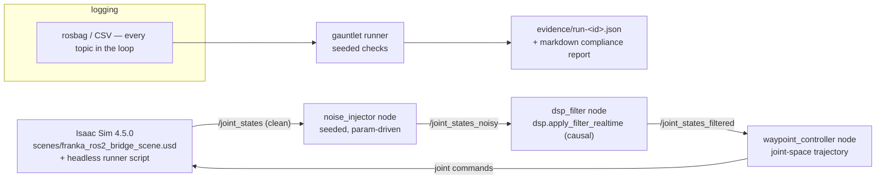

# Sim-to-Real Control Systems

**Sim-to-real with receipts.** One recorded closed-loop demo with
certification-style evidence: a Franka arm in Isaac Sim tracks a joint-space
trajectory, injected sensor noise is cleaned in-loop by this repo's DSP filter,
and every run is auto-graded by a seeded "certification gauntlet" that emits a
JSON evidence packet and a markdown compliance report.

Plan of record: [MASTER_PLAN.md](MASTER_PLAN.md) (intent, requirements,
milestones). Engineering loop and agent lanes: [AGENTS.md](AGENTS.md).

## Pinned versions

Versions are pinned by rule (AGENTS.md §2) — never "latest".

| Component | Version |
|-----------|---------|
| ROS 2 | Humble |
| NVIDIA Isaac Sim | 4.5.0 |
| Python (DSP, no ROS/Isaac needed) | 3.10+ with `numpy`, `scipy` |

## The scenario (binding decision)

Franka joint-space tracking — a Franka arm in Isaac Sim
(`scenes/franka_ros2_bridge_scene.usd`, which carries an OmniGraph ROS 2
joint-state publisher) follows a joint-space trajectory while seeded noise is
injected into `/joint_states` and cleaned in-loop by the causal
`apply_filter_realtime` DSP path. Every run is seeded and reproducible; a
gauntlet grades tracking RMS, settling time, overshoot, and filter attenuation
into an evidence packet. The target artifact is a table of ≥ 20 seeded runs,
filtered vs. unfiltered, plus a 2–3 minute recorded demo.

Non-goals: real hardware, multiple scenarios, RL/learned control,
photorealism, Isaac-in-CI.

## Architecture



## Current status — M1 (Foundations) in progress

Honest state of the repo today:

- **Working now:** the `dsp/` library (FIR/IIR design, causal + zero-phase
  apply, seeded telemetry synthesizer) with passing unit tests; standalone
  Isaac Sim example scripts; the Franka USD scene with its OmniGraph ROS 2
  joint-state publisher; legacy ROS 2 pub/sub example packages in `ros2-ws/`.
- **M1 lanes in flight:** package `dsp/` as installable `s2r-dsp`
  (REQ-S2R-001); unify `scripts/` on the new `isaacsim` import API and add a
  headless Franka scene runner (REQ-S2R-300 partial); this README skeleton
  (REQ-S2R-300 partial).
- **Not built yet:** the `control_loop` ROS 2 package (noise injector, filter
  node, waypoint controller, launch file — M2), the certification gauntlet and
  evidence packets (M3), CI (M3), the results table and recorded demo (M3–M4).
- **Not yet verified on the sim box:** headless runs of
  `scenes/franka_ros2_bridge_scene.usd`; anything marked `EDGEXPERT-VERIFY`
  in `scripts/` awaits a walkthrough on the local Isaac machine (EdgeXpert).

## Repository layout

| Path | Contents | Runs where |
|------|----------|-----------|
| `dsp/` | Filter design, causal/zero-phase apply, seeded telemetry synthesizer, tests, plots | Anywhere (plain Python) |
| `scripts/` | Isaac Sim runner scripts (Franka wave, scene setup, headless runner) | EdgeXpert / local Isaac Sim 4.5.0 box only |
| `scenes/` | `franka_ros2_bridge_scene.usd` with OmniGraph ROS 2 joint-state publisher | EdgeXpert only |
| `ros2-ws/` | ROS 2 Humble workspace: legacy pub/sub examples; `src/control_loop/` lands in M2 | ROS 2 Humble environment |
| `notebooks/` | Exploratory DSP / kinematics notebooks | Anywhere (Jupyter) |
| `media/` | Screenshots and supporting images | — |
| `gauntlet/`, `evidence/` | Certification gauntlet + immutable run evidence (M3, not yet created) | Anywhere |
| `MASTER_PLAN.md`, `AGENTS.md` | Plan of record; engineering loop and lane rules | — |

## How to run what exists today

### DSP (anywhere — the part you can verify in minutes)

```bash
python3 -m venv .venv
source .venv/bin/activate
pip install -r dsp/requirements.txt
pytest dsp/
```

Once REQ-S2R-001 (M1 Lane A) merges, the supported install becomes the
package itself:

```bash
pip install -e dsp/
pytest dsp/
```

Plot generation (Bode + time-domain comparisons) is described in
[QUICKSTART.md](QUICKSTART.md); design rationale lives in
[dsp/FILTER_DESIGN_WALKTHROUGH.md](dsp/FILTER_DESIGN_WALKTHROUGH.md).

### Isaac Sim scripts (local Isaac box only)

Require a local Isaac Sim 4.5.0 install (the EdgeXpert in this project's
setup); they cannot run in CI or cloud environments.

```bash
cd ~/isaac-sim   # your Isaac Sim 4.5.0 root
./python.sh /path/to/repo/scripts/franka_wave.py
./python.sh /path/to/repo/scripts/run_franka_headless.py --steps 600   # after M1 Lane B merges
```

### ROS 2 workspace (ROS 2 Humble environment)

```bash
cd ros2-ws
colcon build
source install/setup.bash
```

See [QUICKSTART.md](QUICKSTART.md) for per-environment details and example
entry points.

## Requirements & milestones

Work is traced to REQ IDs (REQ-S2R-001 … REQ-S2R-300) defined in
[MASTER_PLAN.md](MASTER_PLAN.md) §3; every PR cites the requirements it
advances. Milestones: M1 foundations → M2 closed loop → M3 gauntlet + CI →
M4 record & ship.

## Public demos

- Isaac Sim robot motion: https://youtu.be/MKuvEEEHLwQ
- Isaac Sim to ROS 2 data stream: https://youtu.be/2jHL1TsLq30

## Related public reference

Robotics terminology and SysML v2 examples: https://github.com/camirian/robotics-ontology-public

## License

Licensed under the Apache License 2.0. See [LICENSE](LICENSE).
