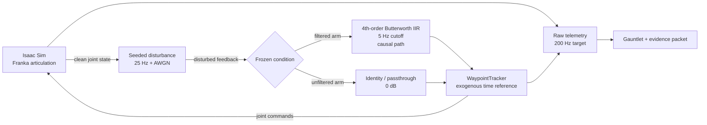
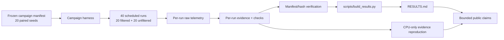
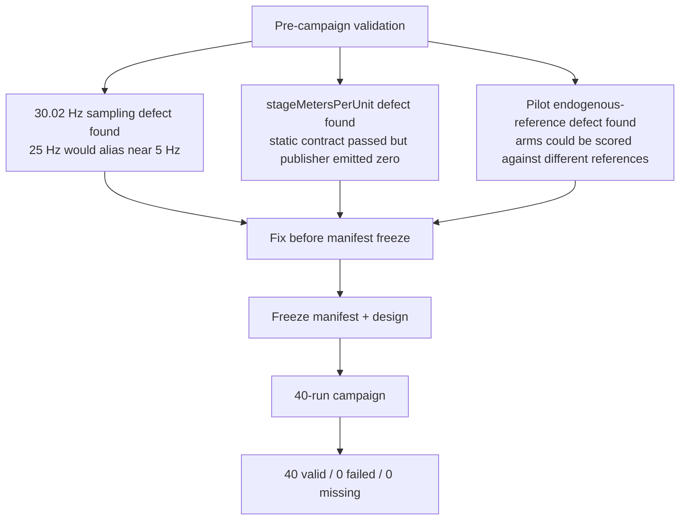
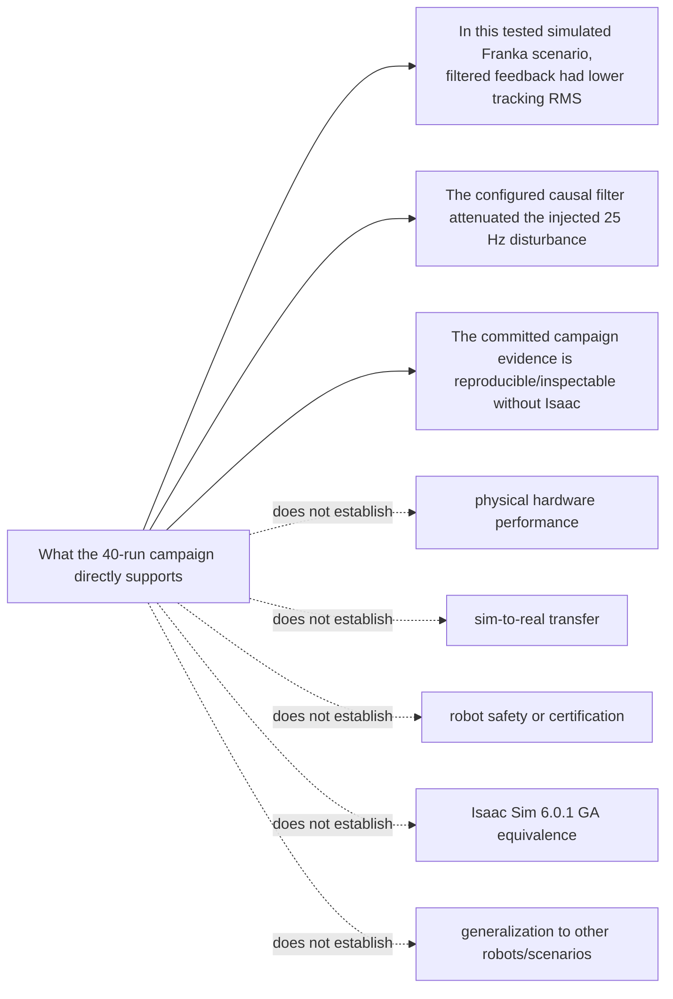

# VRTV-01 — Visual Round-Trip Review of the Frozen M4 Campaign

**Status:** preregistered / started  
**Lane:** M4 docs/distribution  
**Requirement:** REQ-S2R-300 (public explanation, block diagram, results communication, demo)  
**Branch baseline:** `main` at `f03c748ae0b0e6b30de572e9cb7ef49b2c88fe29` when this experiment was opened  
**Technical campaign:** frozen `m4-franka-filtered-vs-unfiltered` v1; no new simulation runs are authorized by this experiment

## 1. Purpose

This is the first dogfood experiment for **Visual Round-Trip Verification (VRTV)**.

The repo already has a completed, independently reviewed 40-run M4 campaign. The experiment asks a narrower question:

> Does giving a reviewer one or more source-grounded visual representations of the same completed evidence reveal valid anomalies, relationships, or claim-boundary issues that are missed or found more slowly in the normal text/source review?

A second question is public-facing:

> Can the same visual views help a human understand what this project actually demonstrated without making the claims look stronger than the evidence supports?

This is a review and communication experiment. It does **not** reopen M4, rerun the campaign, change thresholds, alter evidence packets, or broaden any technical claim.

## 2. Frozen source set

All reviewer conditions must reason from the same underlying committed state.

Primary sources:

- `README.md`
- `RESULTS.md`
- `MASTER_PLAN.md`
- `docs/M4_RUNTIME_VALIDATION.md`
- `docs/REPRODUCE_CAMPAIGN.md`
- the frozen manifest under `campaign/manifests/`
- committed M4 evidence under `campaign/results/m4-franka-filtered-vs-unfiltered-v1/`

Important fixed facts from `RESULTS.md`:

- 20 seeds under two conditions = 40 scheduled runs;
- 40/40 valid, 0 invalid, 0 failed, 0 missing;
- evidence integrity passed with 120/120 files re-hashed;
- filtered tracking RMS mean `0.1767 rad` vs unfiltered `0.4055 rad`;
- paired mean tracking-RMS difference `-0.2288 rad`, 95% bootstrap interval `[-0.2484, -0.2123]`;
- filtered better on tracking RMS in 20/20 seed pairs;
- 25 Hz attenuation mean `48.12 dB` filtered vs `0 dB` passthrough;
- one filtered run and ten unfiltered runs never settled under the frozen settling definition;
- all empirical campaign evidence is from Isaac Sim `6.0.1-rc.7+release.42383.32955d8d.gl`, not 6.0.1 GA;
- simulation only; no hardware, sim-to-real transfer, robot-safety, certification, compliance, production-readiness, or cross-scenario generalization claim.

## 3. The source-grounded visual packet

These diagrams are derived from the committed architecture and evidence descriptions. They are **review surfaces, not canonical truth**. Any finding must be checked against the sources above.

### View A — closed-loop system topology



Review questions this view is intended to make easier:

- Are the two experimental arms actually different in only the intended place?
- Is the disturbance injected before the condition split?
- Is the controller reference independent of controller progress?
- Is the causal filter the in-loop path?
- What feedback or evidence path could accidentally introduce a confound?

### View B — evidence provenance and publication path



Review questions:

- Where can a claim be traced back to raw evidence?
- Which artifact is generated rather than hand-entered?
- Does any public statement bypass the evidence chain?
- Could a stale derived artifact disagree with the raw packets?

### View C — experiment controls and historical defects



Review questions:

- Which findings are campaign evidence versus pre-campaign learning?
- Does the public story accidentally count debugging observations as experimental runs?
- Are the historical defects evidence that runtime validation adds value beyond static checks?

### View D — claim boundary



This view is intentionally public-facing. Its success criterion is not beauty; it is whether a reader can correctly state both the positive result and the non-claims.

## 4. Reviewer conditions

Use independent fresh reviewers where possible. Do not show one reviewer's findings to another until all conditions have been recorded.

### V0 — text/source baseline

Provide the frozen source set. Do not provide this experiment document or its diagrams.

Prompt:

```text
Review this completed M4 campaign as a skeptical technical reviewer. Identify concrete defects, contradictions, provenance gaps, misleading claims, missing limitations, or architecture/evidence inconsistencies. Separate valid findings from hypotheses. For every finding, cite the exact source artifact or field that would confirm or refute it. Do not propose new features.
```

### V1 — visual packet first

Provide only Views A–D plus a short legend that they are non-authoritative projections of a completed campaign. Do not provide the prose findings from V0.

Prompt:

```text
Inspect these four visual projections of a completed simulation campaign. Identify suspicious topology, evidence-chain, experiment-design, or claim-boundary relationships that deserve source verification. Do not assume the diagrams are correct. Return hypotheses only, each with the exact source information you would request to verify it.
```

Then give the reviewer the frozen source set and ask it to verify or reject its own hypotheses.

### V2 — text + visual

Provide the full frozen source set and Views A–D together.

Use the V0 prompt plus:

```text
Use the visual projections as additional review surfaces, not as evidence. If a diagram suggests a problem, trace it back to the source before accepting the finding.
```

### V3 — fresh cross-representation verifier

Give a new reviewer the candidate findings from V0–V2, randomized and stripped of which condition produced them.

Prompt:

```text
For each candidate finding, determine whether the committed source supports it, refutes it, or leaves it unresolved. Prefer deterministic evidence over model judgment. Record the exact source path/field and do not infer a stronger claim than the artifact supports.
```

## 5. Human-comprehension mini-test

For the public-facing question, show a reader either:

- **H0:** the current README status/results prose; or
- **H1:** Views A, B, and D followed by the same prose.

Ask five questions without allowing the reader to reopen the material:

1. What changed between the filtered and unfiltered arms?
2. How many campaign runs were scheduled and how many were valid?
3. What was the primary measured improvement?
4. Was real hardware involved?
5. Does this repo claim sim-to-real transfer or Isaac 6.0.1 GA equivalence?

Record correctness and time-to-answer. The visual condition only earns adoption if comprehension improves without increasing claim inflation.

## 6. Scoring

For each reviewer condition record:

| Metric | Meaning |
|---|---|
| valid findings | findings confirmed by source |
| novel valid findings | confirmed findings not found in V0 |
| false positives | findings refuted by source |
| unresolved hypotheses | source is insufficient |
| time to first valid finding | wall-clock if available |
| review duration | wall-clock if available |
| token/cost | if provider reports it |
| traceability rate | accepted findings tied to exact source |
| claim-boundary errors | reviewer incorrectly broadens the result |

The most important metric is **novel valid findings at acceptable false-positive cost**. For the public mini-test, the main metric is correct comprehension of both the result and the non-claims.

## 7. Pre-registered interpretation

- If V1/V2 finds no additional valid issue and does not improve human comprehension, do **not** promote VRTV for this task class.
- If visuals mostly create false positives, narrow or discard the representations rather than tuning prompts to make the experiment look successful.
- If V2 improves comprehension but not defect detection, use visual views primarily for distribution/documentation, not verification.
- If V1/V2 produces reproducible novel valid findings, repeat on at least one different repository before promoting VRTV into a reusable harness/skill.
- A single attractive diagram is not evidence of benefit.

## 8. Guardrails

- No image, diagram, animation, or video may become the canonical technical source.
- No public visual may omit the simulation-only boundary when presenting M4 results.
- No diagram may imply hardware validation, sim-to-real transfer, certification, safety, production readiness, or GA equivalence.
- Model-generated visuals must be labeled as generated abstractions unless their contents are deterministically derived and reproducible.
- Findings suggested by a visual reviewer remain hypotheses until source-verified.
- This experiment must not modify committed M4 evidence or campaign outputs.

## 9. What would come next

If VRTV-01 shows useful lift, the next experiments should deliberately test different representation classes rather than clone this exact diagram set:

1. **Fieldheld Recorder:** evidence-bundle topology and PR-risk matrices.
2. **Robotics Ontology Public:** render multiple views from SysML v2 textual models and test model/view consistency.
3. **UI-bearing repos:** screenshot actual rendered states and compare against requirements or reference designs.

The long-term hypothesis is a model-based agent workflow where one structured source can produce multiple purpose-built views for different concerns—architecture, behavior, evidence, trust, operations, and public explanation—while the source remains authoritative.
