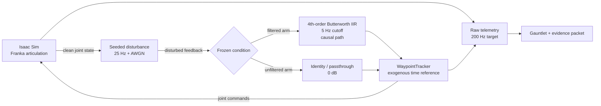
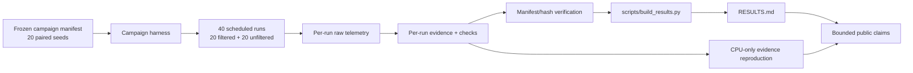
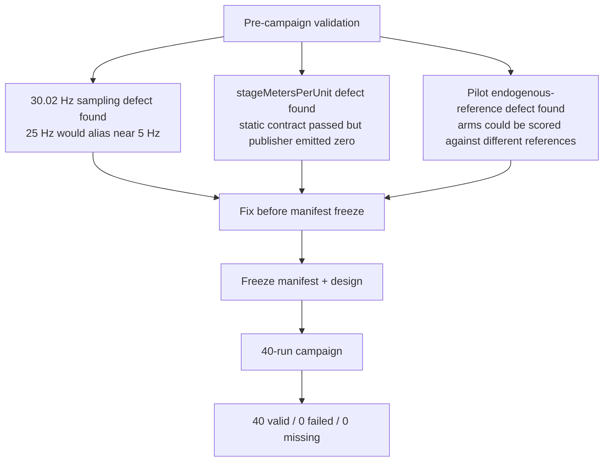
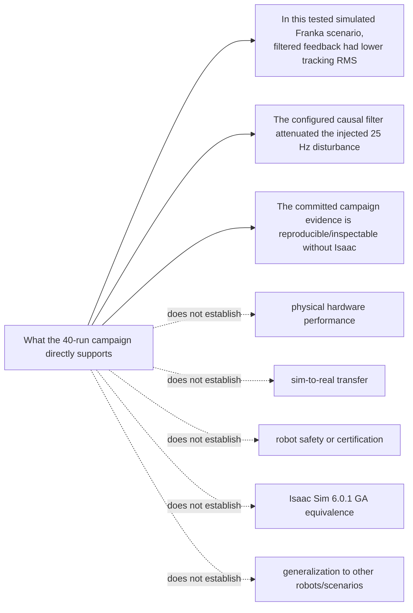

# VRTV-01 — Visual Round-Trip Review of the Frozen M4 Campaign

**Status:** preregistered / started  
**Lane:** M4 docs/distribution  
**Requirement:** REQ-S2R-300 (public explanation, block diagram, results communication, demo)  
**Branch baseline:** `main` at `f03c748ae0b0e6b30de572e9cb7ef49b2c88fe29` when this experiment was opened  
**Technical campaign:** frozen `m4-franka-filtered-vs-unfiltered` v1; no new simulation runs are authorized by this experiment

## 1. Purpose

This is the first dogfood experiment for **Visual Round-Trip Verification (VRTV)**, the visual special case of **Cross-Representation Verification (CRV)**.

The repo already has a completed, independently reviewed 40-run M4 campaign. The experiment asks a narrower question.

**The tested hypothesis is about representation, not about pictures:**

> Does changing the *representation* through which a reviewer receives the same completed evidence change reviewer performance — valid findings, novel findings, false positives, traceability, time — relative to the default source/text representation?

This is deliberately the stronger and fairer framing. "Visual helps" is a directional claim that a single positive result would over-generalize and a single negative result would under-generalize. "Representation changes reviewer performance" is symmetric: a result showing the visual condition performs *worse* is an equally valid, equally publishable outcome, and is the outcome IsoBench would predict for several task classes.

Accordingly, a finding that the visual condition degrades performance is **not** an experiment failure. It is a result.

A second question is public-facing:

> Can the same visual views help a human understand what this project actually demonstrated without making the claims look stronger than the evidence supports?

This is a review and communication experiment. It does **not** reopen M4, rerun the campaign, change thresholds, alter evidence packets, or broaden any technical claim.

## 2. Frozen source set

All reviewer conditions must reason from the same underlying committed state.

Primary sources:

- `README.md`
- `RESULTS.md`
- `MASTER_PLAN.md`
- `docs/M4_RUNTIME_VALIDATION.md`
- `docs/REPRODUCE_CAMPAIGN.md`
- the frozen manifest under `campaign/manifests/`
- committed M4 evidence under `campaign/results/m4-franka-filtered-vs-unfiltered-v1/`

Important fixed facts from `RESULTS.md`:

- 20 seeds under two conditions = 40 scheduled runs;
- 40/40 valid, 0 invalid, 0 failed, 0 missing;
- evidence integrity passed with 120/120 files re-hashed;
- filtered tracking RMS mean `0.1767 rad` vs unfiltered `0.4055 rad`;
- paired mean tracking-RMS difference `-0.2288 rad`, 95% bootstrap interval `[-0.2484, -0.2123]`;
- filtered better on tracking RMS in 20/20 seed pairs;
- 25 Hz attenuation mean `48.12 dB` filtered vs `0 dB` passthrough;
- one filtered run and ten unfiltered runs never settled under the frozen settling definition;
- all empirical campaign evidence is from Isaac Sim `6.0.1-rc.7+release.42383.32955d8d.gl`, not 6.0.1 GA;
- simulation only; no hardware, sim-to-real transfer, robot-safety, certification, compliance, production-readiness, or cross-scenario generalization claim.

## 3. The source-grounded visual packet

These diagrams are derived from the committed architecture and evidence descriptions. They are **review surfaces, not canonical truth**. Any finding must be checked against the sources above.

### 3.0 Rendered artifacts — what V1 and V2 actually receive

**Mermaid source text is not a visual stimulus.** Handing a reviewer Mermaid code and calling it a visual condition would make V0 and V1 both text conditions, and the experiment's only intended variable would not be manipulated at all. This was a defect in the first draft of this preregistration and is corrected here before any condition runs.

V1 and V2 receive **rendered PNG images only**. They must not receive Mermaid source.

Artifacts, committed with this preregistration:

- Mermaid sources: `docs/vrtv01/views/view_{a,b,c,d}_*.mmd`
- Rendered images: `docs/vrtv01/views/view_{a,b,c,d}_*.png`
- Render script: `docs/vrtv01/render_views.sh`
- Hash manifest: `docs/vrtv01/VIEW_HASHES.txt`

Render procedure, pinned for reproducibility:

```text
@mermaid-js/mermaid-cli@11.12.0
--theme neutral --backgroundColor white --width 1600 --scale 2
```

Regeneration is `docs/vrtv01/render_views.sh`, which re-renders every view and rewrites `VIEW_HASHES.txt`. Before execution, issue #17 must confirm the committed PNG hashes match `VIEW_HASHES.txt`. If a re-render produces different bytes on a different machine, record that fact — renderer non-determinism is itself a transformation-provenance finding, and the committed PNGs remain the authoritative stimulus for this experiment regardless.

### 3.1 Per-view provenance

Every view declares its source, transformation, representation class, and known omissions. Reviewers in V1/V2 receive the class and omissions; they do **not** receive this table's "known confound" column.

| View | Authoritative source | Transformation | Class | Known omissions / lossiness |
|---|---|---|---|---|
| A — topology | `README.md`, `MASTER_PLAN.md`, `docs/M4_RUNTIME_VALIDATION.md`, `ros2-ws/` node structure | hand-authored from prose, not mechanically extracted | **I** (inferred), with P intent | no rates except those labeled; no message types; no QoS; no node/process boundaries; filter order/cutoff shown but not coefficients |
| B — evidence provenance | `docs/REPRODUCE_CAMPAIGN.md`, `campaign/manifests/`, `scripts/build_results.py` | hand-authored from prose | **I**, with P intent | no file counts; no hash algorithm; does not show which fields are hand-entered vs generated — which is precisely one of its own review questions |
| C — controls and history | pre-campaign commit history and `docs/M4_RUNTIME_VALIDATION.md` | hand-authored, **curated by someone who already knew the answers** | **I** | omits every defect that was found and fixed without leaving a doc trace; the three shown are not a complete defect population |
| D — claim boundary | `RESULTS.md` §claims, `README.md` status | hand-authored from prose | **I**, with P intent | omits `overshoot_pct` and `settling_time_s` results entirely; omits that the settling-time interval is computed over only 10/20 finite pairs |

**All four views are Class I or P/I — inferred abstractions, not deterministic projections.** None is mechanically derived from source. This bounds what the experiment can conclude: a result here says something about *hand-authored diagrams of a completed campaign*, and must **not** be generalized to semantically equivalent modalities (OPM-style), compiler IRs, formal models, rendered simulation scenes, or telemetry plots. Those are different representation classes with different failure modes.

Because the views are Class I, **transformation error is a live hypothesis, not an edge case.** A V1/V2 finding may be true of the diagram and false of the system.

### 3.2 Known design confound — View C

**View C names three real historical defects** (30.02 Hz sampling, `stageMetersPerUnit`, endogenous reference). V0 must discover these unaided from source; V1 and V2 are handed them.

This is a genuine bias in favor of the visual conditions and it is recorded here rather than discovered afterward. View C is retained because it carries real public-communication value and because removing it would leave the packet unable to address the pre-campaign-versus-campaign-evidence question at all.

Mandatory controls:

- Any V1/V2 finding traceable to content stated on the face of View C is scored as **PRE-DISCLOSED** and is **excluded from the "novel valid findings" metric**, which is the experiment's primary outcome measure.
- The adjudicator applies this exclusion, not the reviewer, and applies it blind to condition.
- PRE-DISCLOSED findings are still recorded — they measure whether a reviewer can *use* disclosed information correctly, which is a different and lesser claim.

### 3.3 Seeded transformation controls

Without a negative control, §7's branch "discrepancies mostly arise from transformation error" cannot be evaluated, and the experiment cannot distinguish a reviewer who detects real problems from one who accepts whatever the diagram says.

Before execution, issue #17 must produce **one seeded variant of View A and one of View B**, each containing exactly one deliberate, source-contradicting alteration — for example a disturbance injected *after* the condition split, or a claim path bypassing hash verification. Seeded variants live in `docs/vrtv01/seeded/`, are hashed alongside the primary views, and their defect list is held by the adjudicator only.

Assignment: half the V1 and V2 reviewer instances receive the seeded packet, half the clean packet. Reviewers are not told seeding occurs.

**Seeded-defect detection rate is a primary robustness metric.** A condition that produces novel findings but cannot detect a planted contradiction has not demonstrated verification value — it has demonstrated fluency.

### View A — closed-loop system topology



Review questions this view is intended to make easier:

- Are the two experimental arms actually different in only the intended place?
- Is the disturbance injected before the condition split?
- Is the controller reference independent of controller progress?
- Is the causal filter the in-loop path?
- What feedback or evidence path could accidentally introduce a confound?

### View B — evidence provenance and publication path



Review questions:

- Where can a claim be traced back to raw evidence?
- Which artifact is generated rather than hand-entered?
- Does any public statement bypass the evidence chain?
- Could a stale derived artifact disagree with the raw packets?

### View C — experiment controls and historical defects



Review questions:

- Which findings are campaign evidence versus pre-campaign learning?
- Does the public story accidentally count debugging observations as experimental runs?
- Are the historical defects evidence that runtime validation adds value beyond static checks?

### View D — claim boundary



This view is intentionally public-facing. Its success criterion is not beauty; it is whether a reader can correctly state both the positive result and the non-claims.

## 4. Reviewer conditions

Use independent fresh reviewers where possible. Do not show one reviewer's findings to another until all conditions have been recorded.

### V0 — text/source baseline

Provide the frozen source set. Do not provide this experiment document or its diagrams.

Prompt:

```text
Review this completed M4 campaign as a skeptical technical reviewer. Identify concrete defects, contradictions, provenance gaps, misleading claims, missing limitations, or architecture/evidence inconsistencies. Separate valid findings from hypotheses. For every finding, cite the exact source artifact or field that would confirm or refute it. Do not propose new features.
```

### V1 — visual packet first

Provide only the four **rendered PNG images** plus the class/omissions legend from §3.1 and a note that they are non-authoritative projections of a completed campaign. **Do not provide Mermaid source.** Do not provide the prose findings from V0.

Prompt:

```text
Inspect these four visual projections of a completed simulation campaign. Identify suspicious topology, evidence-chain, experiment-design, or claim-boundary relationships that deserve source verification. Do not assume the diagrams are correct. Return hypotheses only, each with the exact source information you would request to verify it.
```

Then give the reviewer the frozen source set and ask it to verify or reject its own hypotheses.

### Condition symmetry — required

V1 is a **two-stage** protocol: hypothesize, then verify against source. If V0 and V2 are single-stage, then V1 differs from them in *two* ways — representation access and protocol shape — and any difference in outcome is unattributable.

Therefore **all three conditions run the same two-stage protocol**:

1. **Stage 1 — orientation.** The reviewer receives only its condition's starting material (V0: source set. V1: images. V2: source set + images) and produces candidate findings or hypotheses, each naming the exact source artifact or field that would confirm or refute it. Stage 1 output is saved before stage 2 begins.
2. **Stage 2 — verification.** The reviewer receives the full frozen source set and marks each of its own stage-1 items confirmed, rejected, or unresolved.

For V0 and V2 stage 2 supplies material the reviewer already holds; that asymmetry is unavoidable and is recorded rather than hidden. What matters is that the *number of reasoning passes and the output schema are identical across conditions.*

The stage-1 prompt is identical for all three conditions except for the sentence naming what was provided. Do not add condition-specific instructions such as "trace it back to the source before accepting" to one condition only — that is a quality instruction, and giving it to the visual conditions alone would confound representation access with prompt quality.

### V2 — text + visual

Provide the full frozen source set and the four rendered PNGs together. Use the same two-stage protocol and the same stage-1 prompt as V0 and V1, with the provided-material sentence naming both.

### V3 — fresh cross-representation verifier

Give a new reviewer the candidate findings from V0–V2, randomized and stripped of which condition produced them.

Prompt:

```text
For each candidate finding, determine whether the committed source supports it, refutes it, or leaves it unresolved. Prefer deterministic evidence over model judgment. Record the exact source path/field and do not infer a stronger claim than the artifact supports.

Then classify the finding's failure mode:

SOURCE_DEFECT          - the committed source really has this problem
REPRESENTATION_DEFECT  - the source is correct; a supplied view misstates it
REVIEWER_ERROR         - neither source nor view supports this; the reviewer introduced it
UNRESOLVED             - the committed evidence is insufficient to decide

For REPRESENTATION_DEFECT, name the specific view and the specific element that is wrong.
```

The four-way classification is required, not optional. Without it a wrong finding cannot be attributed, and H3's falsifier — "discrepancies mostly arise from transformation error and do not reveal source defects" — is untestable. This is the single most important addition to V3.

The adjudicator also holds the seeded-defect list from §3.3 and the View C pre-disclosure list from §3.2, and applies both exclusions blind to condition.

## 5. Human-comprehension mini-test

For the public-facing question, show a reader either:

- **H0:** the current README status/results prose; or
- **H1:** Views A, B, and D followed by the same prose.

Ask five questions without allowing the reader to reopen the material:

1. What changed between the filtered and unfiltered arms?
2. How many campaign runs were scheduled and how many were valid?
3. What was the primary measured improvement?
4. Was real hardware involved?
5. Does this repo claim sim-to-real transfer or Isaac 6.0.1 GA equivalence?

Record correctness and time-to-answer. The visual condition only earns adoption if comprehension improves without increasing claim inflation.

**Statistical honesty.** With the two independent readers issue #17 requires as a minimum, this test cannot support a quantitative claim. Two readers per arm detects only overwhelming effects and cannot distinguish a real difference from reader variation.

Therefore:

- With fewer than 5 readers per arm, H0/H1 is recorded as **INDICATIVE_ONLY** and may not be cited as evidence of comprehension lift in any public artifact.
- With fewer than 2 readers per arm, record **NOT_RUN**.
- **Do not substitute a model for a human reader.** A language model answering comprehension questions measures something else entirely and would silently convert a human-factors claim into a model-behavior claim.
- Question 5 ("does this repo claim sim-to-real transfer or GA equivalence?") is the claim-inflation probe and is the only one whose failure is disqualifying: if the visual arm increases wrong answers on question 5, the visual packet is **not** public-safe regardless of how it scores elsewhere.

## 6. Scoring

For each reviewer condition record:

| Metric | Meaning |
|---|---|
| valid findings | findings confirmed by source |
| novel valid findings | confirmed findings not found in V0 |
| false positives | findings refuted by source |
| unresolved hypotheses | source is insufficient |
| time to first valid finding | wall-clock if available |
| review duration | wall-clock if available |
| token/cost | if provider reports it |
| traceability rate | accepted findings tied to exact source |
| claim-boundary errors | reviewer incorrectly broadens the result |
| pre-disclosed findings | findings restating content on the face of View C — excluded from novel valid findings (§3.2) |
| seeded-defect detection | planted view/source contradictions caught, of those planted (§3.3) |
| failure-mode attribution | V3's split of wrong findings into source defect / representation defect / reviewer error |

The most important metric is **novel valid findings at acceptable false-positive cost**. For the public mini-test, the main metric is correct comprehension of both the result and the non-claims.

## 7. Pre-registered interpretation

- If V1/V2 finds no additional valid issue and does not improve human comprehension, do **not** promote VRTV for this task class.
- If visuals mostly create false positives, narrow or discard the representations rather than tuning prompts to make the experiment look successful.
- If V2 improves comprehension but not defect detection, use visual views primarily for distribution/documentation, not verification.
- If V1/V2 produces reproducible novel valid findings, repeat on at least one different repository before promoting VRTV into a reusable harness/skill.
- A single attractive diagram is not evidence of benefit.
- A result showing the visual conditions perform **worse** than V0 is a valid, reportable outcome and must be published with the same prominence as a positive one. IsoBench predicts exactly this for several task classes.

### Decision rule

The experiment terminates in exactly one of:

| Outcome | Condition |
|---|---|
| `PROMOTE_FOR_SECOND_DOGFOOD` | V1 or V2 produces novel valid findings that are not PRE-DISCLOSED, at a false-positive rate not worse than V0, **and** seeded-defect detection is non-zero |
| `PUBLIC_COMMS_ONLY` | comprehension improves with no regression on question 5, but no novel valid technical findings |
| `REVISE_AND_REPEAT` | a specific, named design defect invalidated a condition — not "the result was disappointing" |
| `STOP_NO_LIFT` | no novel valid findings and no comprehension gain, or false positives exceed V0 materially |

Note the spelling `PUBLIC_COMMS_ONLY`; issue #17 currently writes `PUBLIC-COMMS_ONLY` in one place. This document's spelling governs.

### Preregistration freeze

This document is the preregistration. Once **any** reviewer condition has been executed:

- no view may be added, removed, re-rendered, or edited;
- no prompt may be reworded;
- no metric may be added, dropped, or redefined;
- no decision-rule threshold may be moved.

The frozen preregistration is the commit SHA of this file recorded in issue #17 before V0 begins, together with `docs/vrtv01/VIEW_HASHES.txt`. Any material change after execution starts creates **VRTV-02** with its own preregistration; it does not rewrite VRTV-01.

This rule exists because the most likely way this experiment produces a false positive is not a bad diagram — it is a well-intentioned post-hoc adjustment made by someone who has already seen which condition won.

## 8. Guardrails

- No image, diagram, animation, or video may become the canonical technical source.
- No public visual may omit the simulation-only boundary when presenting M4 results.
- No diagram may imply hardware validation, sim-to-real transfer, certification, safety, production readiness, or GA equivalence.
- Model-generated visuals must be labeled as generated abstractions unless their contents are deterministically derived and reproducible.
- Findings suggested by a visual reviewer remain hypotheses until source-verified.
- This experiment must not modify committed M4 evidence or campaign outputs.

## 9. What would come next

If VRTV-01 shows useful lift, the next experiments should deliberately test different representation classes rather than clone this exact diagram set:

1. **Fieldheld Recorder:** evidence-bundle topology and PR-risk matrices.
2. **Robotics Ontology Public:** render multiple views from SysML v2 textual models and test model/view consistency.
3. **UI-bearing repos:** screenshot actual rendered states and compare against requirements or reference designs.

The long-term hypothesis is a model-based agent workflow where one structured source can produce multiple purpose-built views for different concerns—architecture, behavior, evidence, trust, operations, and public explanation—while the source remains authoritative.
