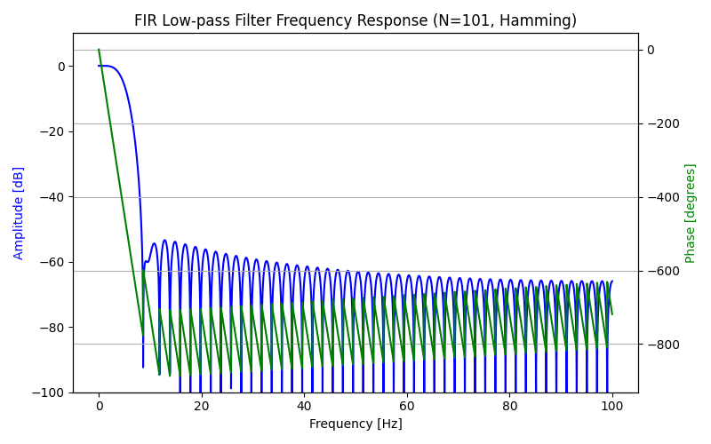
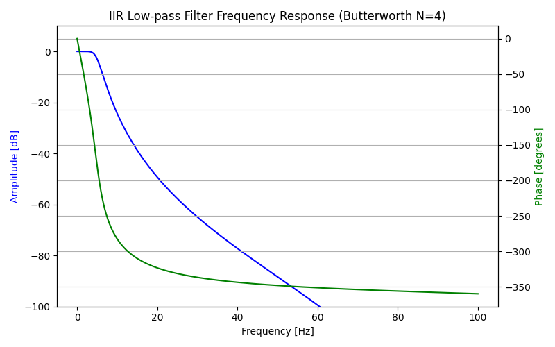
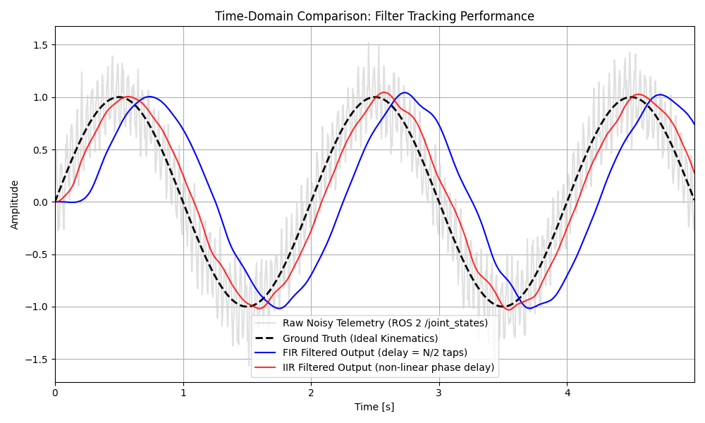

# Digital Signal Processing: Filter Design Walkthrough
## ROS 2 `/joint_states` Telemetry Noise Reduction

This document mathematically and empirically analyzes the application of digital filters to noisy sensor telemetry typically encountered in a ROS 2 `/joint_states` hardware interface. It serves as proof of proficiency for advanced signal processing design applicable to real-world cyber-physical systems.

### 1. Problem Definition
When implementing closed-loop control on physical robot hardware, sensor telemetry is rarely ideal. The true kinematic state of a joint is often masked by:
1.  **Additive White Gaussian Noise (AWGN):** Arising from ADC quantization or electrical interference.
2.  **High-Frequency Aliasing/Vibrations:** Structural resonances or motor hum that fold into the observed signal if not properly anti-aliased.

To synthesize this, we generated a 0.5 Hz base kinematic signal superimposed with a 25 Hz structural vibration and AWGN, sampled continuously at an industry-standard 200 Hz.

---

### 2. Digital Filter Selection: FIR vs. IIR

To isolate the 0.5 Hz true kinematic motion, we engineered two distinct low-pass digital filters with a 5.0 Hz cutoff frequency:

#### Finite Impulse Response (FIR)
*   **Design:** 101-tap low-pass filter using a Hamming window.
*   **Trade-offs:** FIR filters guarantee stability and provide exact **linear phase**, meaning all passed frequency components are delayed by the exact same amount of time ($N/2$ samples). However, achieving a sharp amplitude roll-off requires a large number of coefficients ($N=101$), inducing a severe computational load and a noticeable, constant latency (in our case, 50 samples or 0.25 seconds).
*   **Application:** Excellent for offline data processing or trajectory alignment where zero-phase forward-backward filtering (e.g., `scipy.signal.filtfilt`) can be safely applied.

#### Infinite Impulse Response (IIR)
*   **Design:** 4th-order Butterworth low-pass filter.
*   **Trade-offs:** IIR filters achieve an exceptionally sharp roll-off with minimal coefficients (only 4th order), making them extremely fast to compute and highly suitable for **real-time edge controllers**. The primary drawback is **non-linear phase delay**, which can mathematically distort the signal's shape in the time domain, alongside a potential for instability due to numerical quantization of the poles if improperly designed.
*   **Application:** Ideal for causal, real-time ROS 2 feedback loops where minimal latency and CPU cycles are paramount.

---

### 3. Empirical Time-Domain Performance

Applying both filters continuously (mimicking a causal, real-time ROS 2 node stream):

**Engineering Observations:**
*   Both filters successfully reject the 25 Hz high-frequency vibration and smooth out the ambient AWGN, cleanly isolating the 0.5 Hz base kinematic signal.
*   The **FIR filter** introduces a significant, constant time lag as anticipated by its linear phase property. This lag could drastically destabilize a PID closed-loop torque controller.
*   The **IIR filter** tracks the true target trajectory much more closely in active real-time due to its lower order and minimal delay. 

**Conclusion:** For real-time Guidance, Navigation, and Control (GN&C) subsystems, an IIR Butterworth filter is the strongly preferred choice when empirically balancing noise rejection against phase latency in an active physical feedback loop.
